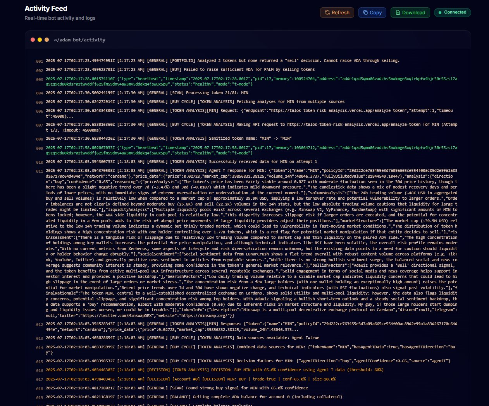

# ADAM Litepaper

<figure><figcaption><p>AI‑Driven Adaptive Market Making (ADAM)</p></figcaption></figure>

***

### Abstract

AI‑Driven Adaptive Market Making (ADAM) is an autonomous portfolio‑balancing and liquidity‑provisioning system built on Cardano. ADAM combines deterministic rebalancing logic with real‑time, AI‑powered token‑risk analysis provided by [**T**](https://x.com/agentic_t), Flux Point Studios’ agentic intelligence entity. The goal is to maintain optimal asset allocation based on user specifications while surfacing actionable insights on market conditions, social sentiment, and on‑chain metrics—empowering users to compound yield with lower risk.

***

### Motivation

Traditional market‑making and rebalancing strategies rely on static rules that ignore rapidly evolving token fundamentals, community sentiment, and liquidity shocks. DeFi participants need:

* **Adaptive execution** that reacts to changing risk factors.
* **Actionable intelligence** distilled from diverse data sources.
* **Non‑custodial automation** they can trust.

ADAM addresses these gaps by unifying a rules‑based rebalancer with **T**'s risk‑analysis engine.

***

### System Overview

```
┌────────────────────────────┐
│  Wallet / Portfolio State  │  ← UTxO snapshot + prices
└──────────────┬─────────────┘
               │ fetch
               ▼
┌────────────────────────────┐
│  Allocation Analyzer       │  ← target %, tolerance
└──────────────┬─────────────┘
   needs rebalance? │ yes             no │
               ▼                      ▼
┌────────────────────────────┐   ┌─────────────────────────┐
│  Rebalancing Engine        │   │  Sleep / Monitor        │
│  (deterministic)           │   └─────────────────────────┘
└──────────────┬─────────────┘
               │ builds tx
               ▼
┌────────────────────────────┐
│  Trade Execution Layer     │  ← DEX router
└──────────────┬─────────────┘
               │ tx hash
               ▼
┌────────────────────────────┐
│  AI Risk Analyzer (T)      │  ← TapTools, Xerberus, X, Others
└──────────────┬─────────────┘
               │ notifications / dashboard
               ▼
           End‑user / dApp
```

***

### Parameters (User Specified)

<table><thead><tr><th>Variable</th><th>Default</th></tr></thead><tbody><tr><td><p></p><pre class="language-properties"><code class="lang-properties">MIN_PROFIT_THRESHOLD
</code></pre></td><td><p></p><pre class="language-properties"><code class="lang-properties">0.02
</code></pre></td></tr><tr><td><pre><code>MAX_POSITION_SIZE_ADA
</code></pre></td><td><pre><code>100
</code></pre></td></tr><tr><td><pre><code>MIN_TRADE_SIZE_ADA
</code></pre></td><td><pre><code>50
</code></pre></td></tr><tr><td><pre><code>MAX_SLIPPAGE
</code></pre></td><td><pre><code>3.0
</code></pre></td></tr></tbody></table>

***

### AI‑Enhanced Risk Analysis

While the deterministic engine keeps allocations on target, **T** continuously scores each token on:

* **Price momentum & liquidity** (DEX volumes, order‑book depth)
* **On‑chain health** (active wallets, whale flows, contract events)
* **Social sentiment** (Twitter/X, Discord, Reddit activity)

#### Unified API

```bash
POST /analyze-token
{
  "tokenName": "SNEK",
  "policyId": "279c909f348e533da5808898f87f9a14...",
  "network": "cardano"
}
```

The response returns a directional bias (Bullish / Bearish), confidence level, and explanatory bullet points. Users can opt‑in to:

* **Alerts** before rebalances if risk spikes.
* **Override suggestions** (e.g., pause buys on high‑risk tokens).

### ADAM Analytics Engine Example

<figure><figcaption></figcaption></figure>


***

### Implementation Stack

| Layer                                                   | Tech                                                                                                                                                                    |
| ------------------------------------------------------- | ----------------------------------------------------------------------------------------------------------------------------------------------------------------------- |
| Liquidity Pool Insights and DEX transaction submissions | [https://github.com/IndigoProtocol/dexter](https://github.com/IndigoProtocol/dexter) & [https://github.com/IndigoProtocol/iris](https://github.com/IndigoProtocol/iris) |
| Off‑chain agent runtime                                 | Node.js (TypeScript)                                                                                                                                                    |
| Data ingestion                                          | TapTools, Xerberus, Blockfrost, X, Lunar Crush, ADAWhiz, Market Raker AI                                                                                                |
| Wallet & Tx library                                     | MeshJS + lucid-evolution                                                                                                                                                |

***

### Security & Compliance

* **Non‑custodial keys**: ADAM operates via client‑side wallet signatures; funds never leave user custody.
* **Rate‑limiting**: AI calls are signed + metered; no PII stored.

***

### Launch & Access

**ADAM** will launch in three controlled phases:

* ~~**Phase 1** – Access granted for holders of T1 ADAM Launch Pass (Black and Copper - 250,000 $AGENT - Max Supply of 10 - Earliest Access to Launch and all new features) while we closely monitor operational performance.~~ **Phase 1 Complete. There was a mint issue that allowed 43 passes to be minted. We chose to honor them all. (Secondary Market:** [**https://www.jpg.store/collection/t1adamlaunchpass**](https://www.jpg.store/collection/t1adamlaunchpass)**)**
  * **T1 Benefits:**
    * **LIFETIME ACCESS TO ADAM**
    * **+2 Additional Trading Agents**
* ~~**Phase 2** – Access widens to holders of T2 ADAM Launch Pass (Aluminum - 100,000 $AGENT - Max Supply of 150 - Earlier Access to Launch and all new features). Once again we monitor and confirm stability. (Sale Date: 8/1/2025 at 17:00 UTC).~~ **Phase 2 Complete. (Secondary Market:** [**https://www.jpg.store/collection/t2adamlaunchpass**](https://www.jpg.store/collection/t2adamlaunchpass)**)**&#x20;
  * **T2 Benefits:**
    * **2yr ACCESS TO ADAM (Starting November 1, 2025)**
      * **+1 Additional Trading Agents**
* **Phase 3** – Public launch with ~~20,000 $AGENT~~ 50 $USDM per month subscription for access to ADAM.

These _ADAM Launch Passes_ act as a bridge between users having tiered access now versus waiting 30-60 days until our $AGENT Subscription service has been audited and launched on mainnet.\
\
These Launch Passes will be available starting with T1 on 7/3/2025 at [https://fluxpointstudios.com/adam](https://fluxpointstudios.com/adam)

### $AGENT Subscription

Once launched, users pay ~~2**0,000 $AGENT**~~ 50 $USDM per month to Flux Point Studios _(**2%** of subscription fees go to the on-chain treasury for ecosystem growth)_ to activate **one trading agent bound to a single wallet**. Support for additional agents per user will be introduced in **November 2025**.

***

### Team

[Flux Point Studios, Inc. ](https://fluxpointstudios.com/)

***

### Legal Disclaimer

_This document is for informational purposes only and does not constitute investment advice or an offer to sell any security. Digital asset markets are volatile and carry risk. Always perform your own due diligence._

***

_© 2025 Flux Point Studios, Inc. All rights reserved._
